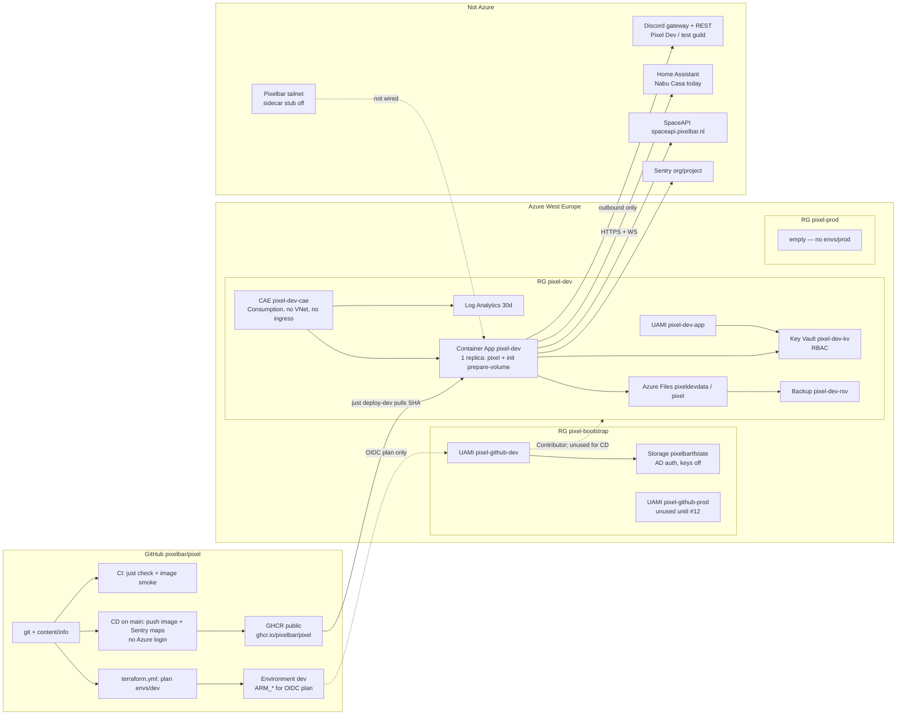
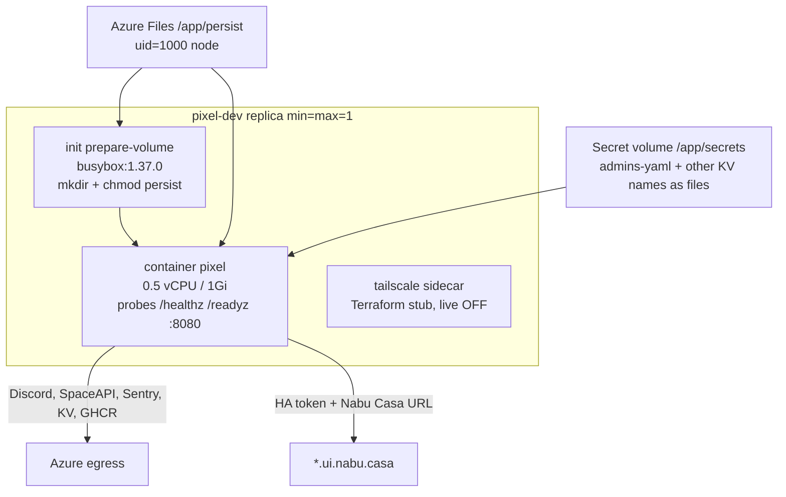

# Pixel infrastructure

How Pixel is hosted. Terraform lives in [`infra/`](../infra/). Day-to-day steps are in the [runbook](runbook.md). Design decisions: [ADR 0008](adr/0008-terraform-bootstrap.md) (bootstrap + OIDC), [ADR 0009](adr/0009-container-apps-dev.md) (Container Apps `dev`), [ADR 0010](adr/0010-ghcr-cd.md) (temporary CD routing).

There is **no database**. Discord users never connect to Azure: the replica has **no public ingress** and **exactly one replica**. `prod` is [#12](https://github.com/pixelbar/pixel/issues/12) (`pixel-prod` is an empty resource group; there is no `infra/envs/prod` yet).

## How the pieces are set

West Europe, subscription in bootstrap / env variables. Live **`pixel-dev`** is the Pixel Dev bot (test guild).

| Piece | Name | Role |
| --- | --- | --- |
| Bootstrap RG | `pixel-bootstrap` | Terraform state + GitHub OIDC identities |
| Dev RG | `pixel-dev` | The running bot |
| Prod RG | `pixel-prod` | Empty until #12 |
| State | `pixelbartfstate` (GRS, shared keys **off**, Azure AD) | Containers `bootstrap`, `dev`, `prod` |
| GitHub OIDC | UAMI `pixel-github-dev` / `pixel-github-prod` | `terraform.yml` **plans** `dev`. CD does **not** apply Terraform and does not deploy Azure |
| App identity | UAMI `pixel-dev-app` | Key Vault Secrets User |
| Key Vault | `pixel-dev-kv` | Secret **values** are not in Terraform state. App references URIs |
| Files | `pixeldevdata` share `pixel` | Writable persist: `members.yaml`, HA files, `data/` |
| Backup | `pixel-dev-rsv` | Daily share backup, 14-day keep (plus 14-day share soft-delete) |
| Logs | `pixel-dev-logs` | Container Apps diagnostics, 30 days |
| CAE | `pixel-dev-cae` | Consumption, **no VNet** |
| App | `pixel-dev` | `min = max` replicas **1**, `revision_mode = Single`, ingress **none** |
| Image | `ghcr.io/pixelbar/pixel:<sha>` (public) | No `.env`, no access YAML. Azure `dev` is rolled by `just deploy-dev`, not CD |

**CD (temporary, ADR 0010):** `just deploy-dev` on a laptop builds linux/amd64, pushes GHCR, `az containerapp update` with min=max=1, then `just register`. Merges to `main` publish GHCR (`:<sha>` and `:main`) and Sentry source maps. They do **not** log in to Azure or touch `pixel-prod`.

## Diagrams

Azure, GitHub, Discord, Home Assistant, and Sentry:



One replica. Containers share a network namespace; they do **not** share filesystems except explicit mounts:



## How they connect

1. **Bootstrap** (hand-applied) created the three resource groups, state storage, and per-env GitHub identities. Env stacks deploy *into* those groups; they do not recreate them.
2. **`infra/modules/pixel`** + **`infra/envs/dev`** created the vault, files share, CAE, app, backup, logs, and `pixel-dev-app`. Remote state is container `dev`.
3. **Secrets** are Key Vault names (`discord-token`, `admins-yaml`, `home-assistant-token`, `sentry-dsn`). The Container App references **URIs + UAMI**. Terraform may write values as ephemeral `write_secrets` inputs, or they are set with `az` / the portal. Discord / HA / Sentry values do **not** belong in state. The Azure Files **account key** does (Container Apps can only mount SMB with the key).
4. **Image:** GHCR is public, so the app pulls with no registry password. `just deploy-dev` updates the running image with `az containerapp update` and does **not** apply Terraform. Pin an explicit SHA (or `dev-dirty-*`), never `latest` alone.
5. **Discord:** outbound gateway + REST. No FQDN. `/healthz` is process up; `/readyz` is Discord connected. Home Assistant is **not** on the probes (HA down must not restart the replica).
6. **Home Assistant:** both URL and token, or neither. Live `dev` uses a Nabu Casa URL. The allow-list is `devices.yaml` on the share. A Tailscale sidecar is the preferred path ([#43](https://github.com/pixelbar/pixel/issues/43), [#74](https://github.com/pixelbar/pixel/issues/74)); the Terraform stub is **off** and is not enough to flip on as-is. Dev must not control the real doors.
7. **Sentry:** the app reads `SENTRY_DSN` from Key Vault. Heartbeat monitor `pixel-<env>`. Source maps on `main` use `SENTRY_AUTH_TOKEN` plus org/project variables.

## Ephemeral vs permanent

| Ephemeral (gone on revision) | Permanent (survives deploys) |
| --- | --- |
| Container root FS, baked `content/` (comes back from the image) | Azure Files share `pixel`: `members.yaml`, `home-assistant/`, `data/` |
| In-memory rate limiter, Discord gateway, HA websocket | Key Vault secret versions (`admins.yaml` history) |
| Init container (mkdir/chmod, then exits) | Share backup + 14-day soft-delete |
| Terraform write-only secret inputs | Terraform state (not Pixel token *values*; does hold Files keys) |

Do not raise replica count. Two replicas (or a laptop `just dev` plus this app) on the same bot token answer every command twice. Stop-then-start during a revision swap is still [#11](https://github.com/pixelbar/pixel/issues/11).

## Where data is seeded from

| Data | Seeded from | Lands | Who writes later |
| --- | --- | --- | --- |
| `DISCORD_TOKEN` | Discord Developer Portal → KV `discord-token` | env | humans, then restart |
| `admins.yaml` | gitignored `config/admins.yaml` (example file is fake IDs only) | KV `admins-yaml` → `/app/secrets/admins-yaml` | humans only; commands never write it |
| `members.yaml` | gitignored `config/members.yaml`, uploaded to the share | `/app/persist/members.yaml` | Pixel (`/admin level`, capabilities) and humans |
| `devices.yaml` | gitignored `config/home-assistant/devices.yaml` | `/app/persist/home-assistant/` | humans; `/admin reload` |
| `inventory.yaml` | not seeded; Pixel writes it from HA | same dir | Pixel |
| HA token / URL | HA long-lived token (non-admin user) + plain URL | KV + env | humans |
| `SENTRY_DSN` | Sentry project → KV | env | humans |
| Image | GHCR (`just deploy-dev` or CD on `main`) | Container App | `az containerapp update` |
| `content/info/*.md` | git, `COPY` in the Dockerfile | image | next image |
| `data/schedules.yaml` | created when someone uses `/schedule` | `/app/persist/data/` | Pixel; **not safe to delete** |
| `data/home-switches.state` | `/admin doors`; missing file → doors default **on**; unreadable → **off** | persist | Pixel |
| Example YAML in git | `config/*.example.yaml` | **never** uploaded to a real bot | local laptop only |

How to seed the share and vault: [dev README](../infra/envs/dev/README.md).

## One replica, no public ingress

Hard constraints in the module (not variables): `min_replicas = 1`, `max_replicas = 1`. `just deploy-dev` re-asserts that and refuses prod names / `PIXEL_ENV=prod`.

Ingress is off. Discord, SpaceAPI, Sentry, GHCR, Key Vault, and today’s Nabu Casa path all use ordinary Azure egress. Nothing in Discord connects *to* Azure.

## What is not in Azure

| Thing | Where it lives |
| --- | --- |
| `admins.yaml` contents | Key Vault, not the Files share and not git |
| `members.yaml` | Azure Files, not Key Vault (the bot rewrites it) |
| Laptop `.env` / `config/*.yaml` | gitignored local files. Do not also run them against the Pixel Dev token while `pixel-dev` is up |
| Example files | git (`*.example.yaml`) |
| Discord | Discord. Tiers are YAML + immutable user IDs |
| Home Assistant | Space / Nabu Casa until the Tailscale sidecar exists |
| Sentry org | Sentry SaaS; the app only needs the DSN |
| Postgres | Deliberately absent ([architecture](architecture.md#deployment)) |
| Prod bot | #12 |

## Operator loop (`dev`)

```sh
just tf-validate          # fmt + validate bootstrap + envs/dev
just tf-plan dev          # needs az login; does not apply
just tf-apply dev         # maintainer; first create / vault / volume
# seed Files: members.yaml + home-assistant/*.yaml  (not the example IDs)
# seed KV if write_secrets was false
just deploy-dev           # this tree → GHCR SHA → pixel-dev, then register
```

Do not apply Terraform from CD. Do not copy `pixel-dev-kv` tokens into prod.
